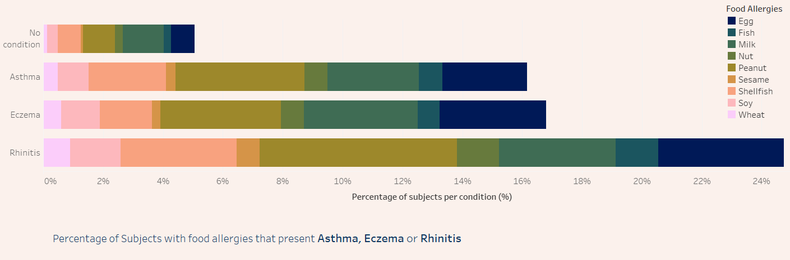
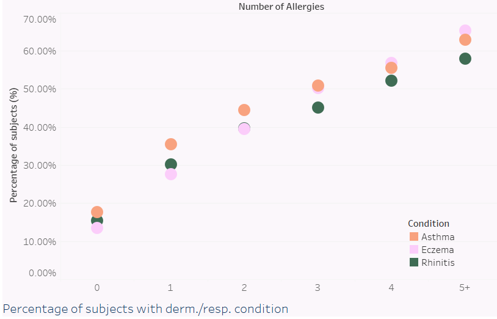

I am a biochemist and a Junior Data Analyst and I like to make the most of my technical background while doing data science projects.
  

### My projects  

[Childhood Allergies](https://github.com/joanafloresc/Childhood_allergies)  

  

  

[{:height="36px" width="36px"}](https://www.linkedin.com/in/joanafloresc/) [{:height="36px" width="36px"}](https://github.com/joanafloresc)